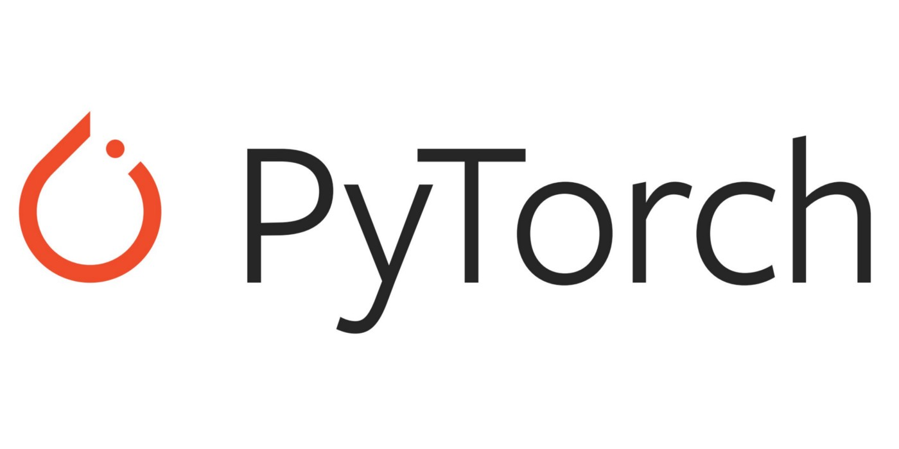
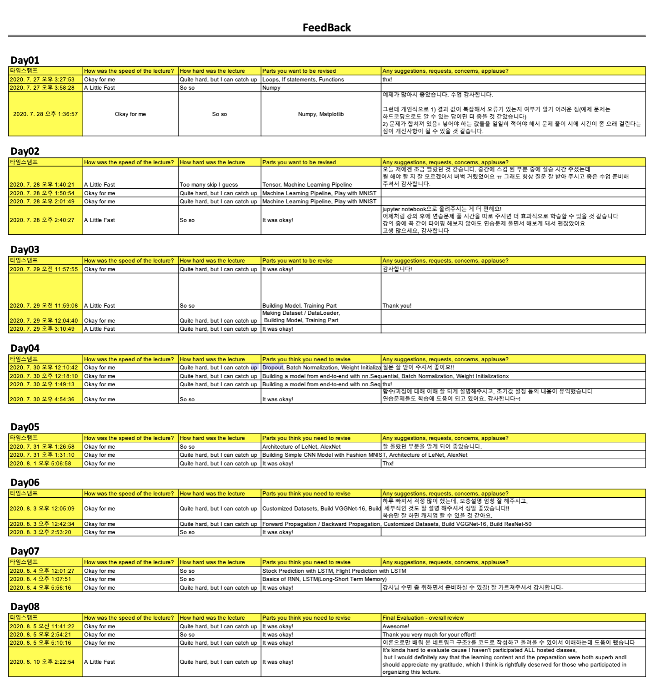

# Hands-on Pytorch 

---

This repository provides tutorial code for deep learning researchers to learn PyTorch. 
If you have any questions in this document, please contact me: hoesungryu@korea.ac.kr

## Course Objectives 

This is an introductory basic-level course on Machine Learning and Deep Learning with Pytorch.
This course who are interested in not only understanding the basic methodology of deep learning & data analytics but also play around with coding yourself. 			
				

## Syllabus 

|Event Type|Date|Topic|
|--:|:---:|:---|
|1 |July 26| Environment setting and python basic|
|2 |July 27| Pytorch basic |
|3 |July 28| Linear Regression|
|4 |July 29| Classification|
|5 |July 30| `Know-how`: Model training |
|6 |July 31| MLP (Multi-Layer Perceptrone|
|7 |Aug 03| CNN (Convolution Neural Network) |
|8 |Aug 04| RNN (Recurrent neural Network) |
|9 |Aug 05| RL (Reincement Learning)| 
|10|Aug 06| **Mini_Kaggle**: Facial Expression Recognition on `AffectNet` | 
|11|Aug 10|`Awards` and `Closing`| 

## Reference 
- https://github.com/yunjey/pytorch-tutorial

## FeedBack 
:loudspeaker:

